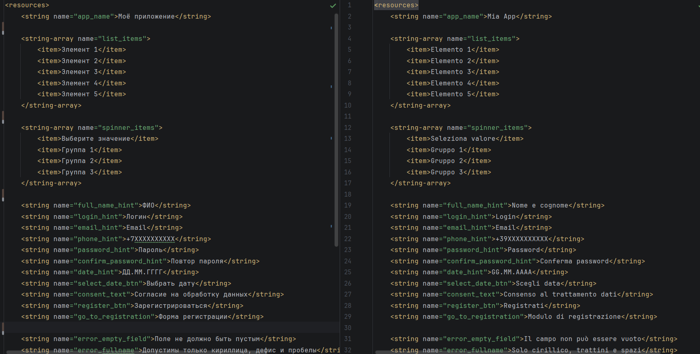
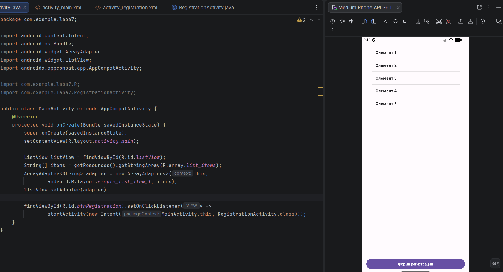
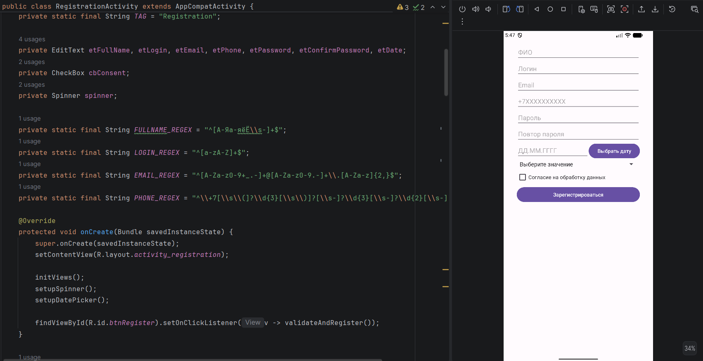

# Отчет

## Практическая работа №7

## Локализация и списки. Формы ввода и валидация данных

**Выполнил:**  
Самойлов Павел Олегович 
**Курс:** 2  
**Группа:** ИНС-б-о-24-1 

**Направление:** 09.03.02

**Профиль:** [Название профиля подготовки]  

**Проверил:**  
Потапов Иван Романович 

---

### Цель работы

Изучить механизмы локализации Android-приложений, научиться работать со списками (ListView, Spinner), освоить различные типы полей ввода и реализовать валидацию пользовательского ввода с использованием регулярных выражений.

### Ход работы
Задание:

1. Создание локализованного списка. Создайте массив строк в ресурсах для двух языков (русский и язык согласно варианту). Отобразите этот список в ListView. При смене языка на устройстве список должен автоматически обновляться (перезапустите приложение после смены языка в настройках).

2. Форма регистрации с валидацией. Реализуйте активность с формой регистрации, как описано в ХОДе работы, со следующими правилами валидации:
3. Выбор даты через DatePickerDialog. Реализуйте выбор даты рождения через диалоговое окно DatePickerDialog (по нажатию на кнопку или поле даты).

- ФИО: только кириллические буквы, дефис и пробелы.
- Логин: только латиница (строчные и заглавные буквы).
- Email: валидный формат email-адреса (используйте регулярное выражение).

- Номер телефона: международный формат с кодом страны (например, +7XXXXXXXXXX или +7 (XXX) XXX-XX-XX).

- Пароль: минимум 6 символов, хотя бы одна цифра и одна заглавная буква (дополнительное усложнение).

- Повтор пароля: должен совпадать с паролем.

- Дата рождения: валидная дата в формате ДД.ММ.ГГГГ, не ранее 1900 года и не позже текущей даты.

- Выпадающее меню (Spinner): заполняется из массива ресурсов согласно варианту.

- Согласие на обработку данных: должно быть отмечено.

При несоответствии любому требованию:

- Поле подсвечивается красным (метод setError()).

- В Logcat выводится сообщение с тегом "Registration" и описанием ошибки.

- Общая регистрация не выполняется.

Создание списков на разных языках.

*Рисунок 1. Списки на русском и на итальянском языке*

Создание главного окна приложения

*Рисунок 2. Главное меню приложения*

Создание окна регистрации

*Рисунок 3. Окно регистрации*

Реализация фукнкции выпадающего списка 

    private void setupSpinner() {
        ArrayAdapter<CharSequence> adapter = ArrayAdapter.createFromResource(this,
                R.array.spinner_items, android.R.layout.simple_spinner_item);
        adapter.setDropDownViewResource(android.R.layout.simple_spinner_dropdown_item);
        spinner.setAdapter(adapter);
    }

Реализация функции валидатора на пустое значение:

    private boolean validateNotEmpty(EditText editText, String errorMsg) {
        String text = editText.getText().toString().trim();
        if (text.isEmpty()) {
            Log.d(TAG, editText.getHint() + " is empty");
            editText.setError(errorMsg);
            return false;
        }
        return true;
    }

Реализация функции валидатора на регулярные выражения:

    private boolean validatePattern(EditText editText, String regex, String errorMsg) {
        String text = editText.getText().toString().trim();
        if (!Pattern.matches(regex, text)) {
            Log.d(TAG, editText.getHint() + " does not match pattern: " + text);
            editText.setError(errorMsg);
            return false;
        }
        return true;
    }
Реалиацзия функции валидатора даты: 

    private boolean validateDate(EditText editText) {
        String dateStr = editText.getText().toString().trim();
        SimpleDateFormat sdf = new SimpleDateFormat("dd.MM.yyyy", Locale.US);
        sdf.setLenient(false);
        try {
            Date parsedDate = sdf.parse(dateStr);
            if (parsedDate == null) {
                throw new ParseException("Invalid date", 0);
            }
            Calendar cal = Calendar.getInstance();
            cal.set(Calendar.HOUR_OF_DAY, 0);
            cal.set(Calendar.MINUTE, 0);
            cal.set(Calendar.SECOND, 0);
            cal.set(Calendar.MILLISECOND, 0);
            Date today = cal.getTime();

            Calendar minDate = Calendar.getInstance();
            minDate.set(1900, Calendar.JANUARY, 1, 0, 0, 0);
            minDate.set(Calendar.MILLISECOND, 0);
            Date min = minDate.getTime();

            if (parsedDate.before(min) || parsedDate.after(today)) {
                Log.d(TAG, "Date out of range: " + dateStr);
                editText.setError(getString(R.string.error_date_range));
                return false;
            }
            return true;
        } catch (ParseException e) {
            Log.d(TAG, "Date parsing error: " + dateStr);
            editText.setError(getString(R.string.error_date_format));
            return false;
        }
    }
### Вывод
В результате выполнения практической работы я изучил механизмы локализации Android-приложений, научился работать со списками (ListView, Spinner), освоил различные типы полей ввода и реализовать валидацию пользовательского ввода с использованием регулярных выражений.

### Ответы на контрольные вопросы
1. Как в Android реализуется локализация приложений? Опишите структуру папок для поддержки нескольких языков. 

Локализация в Android реализуется через ресурсы (strings, dimens, layouts и т.д.). Android автоматически подбирает нужную папку в зависимости от языка устройства.
Структура папок:

res/values/strings.xml — основной
res/values-ru/strings.xml — русский язык

В коде всегда обращаемся так:

`getString(R.string.hello_world);`

2.Для чего используются адаптеры (например, ArrayAdapter) при работе со списками ListView и Spinner?

Адаптер — это мост между данными и элементом интерфейса. 
Основные задачи адаптера:

Хранить данные, создавать View для каждого элемента, переиспользовать элементы для экономии памяти, управлять отображением данных.

ArrayAdapter — самый простой адаптер, который используется, когда данные — это List<String> или массив строк.

3.Какие атрибуты EditText позволяют ограничить тип вводимых данных? Приведите примеры.

Основной атрибут — android:inputType

4.Что такое регулярные выражения? Как с их помощью проверить, что строка является валидным email-адресом?

Регулярные выражения — это шаблон для поиска и проверки соответствия строк определённому формату.

	private boolean isValidEmail(String email) {
    String emailPattern = "[a-zA-Z0-9._%+-]+@[a-zA-Z0-9.-]+\\.[a-zA-Z]{2,}";
    return email != null && email.matches(emailPattern);}

5.Как программно установить ошибку на поле ввода (EditText), чтобы она отображалась пользователю?

	EditText etEmail = findViewById(R.id.etEmail);

	if (email.isEmpty()) {
    	etEmail.setError("Поле не может быть пустым");
    	etEmail.requestFocus();
	} else if (!isValidEmail(email)) {
    	etEmail.setError("Введите корректный email");
	} else {
    	etEmail.setError(null); // убрать ошибку}

6.В чём разница между CheckBox и RadioGroup? В каких случаях используется каждый из них?

CheckBox — каждый существует сам по себе.
RadioGroup — контейнер, который автоматически снимает выбор с других RadioButton при выборе одного.

7.Как вывести диалоговое окно для выбора даты (DatePickerDialog) и получить выбранное значение?

	private void showDatePicker() {
    	Calendar calendar = Calendar.getInstance();

    	DatePickerDialog datePickerDialog = new DatePickerDialog(
        	this,
        	(view, year, month, dayOfMonth) -> {
       	     String selectedDate = dayOfMonth + "." + (month + 1) + "." + year;
          	  Toast.makeText(this, "Выбрана дата: " + selectedDate, Toast.LENGTH_SHORT).show();
        },
        calendar.get(Calendar.YEAR),
        calendar.get(Calendar.MONTH),
        calendar.get(Calendar.DAY_OF_MONTH)
    );

    datePickerDialog.show();}

8.Для чего используется метод String.matches()? Что он возвращает?

Метод String.matches(String regex) — проверяет, соответствует ли вся строка заданному регулярному выражению.
Возвращает: boolean (true / false)
